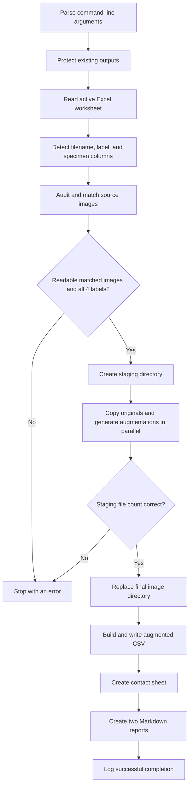

# Explanation of `augmentation/augment_dataset.py`

## Purpose of this document

This document explains the current version of `augmentation/augment_dataset.py` in simple language. It is intended to help explain the script to a professor or another researcher.

The script has one job:

> Read the original corrosion images and their Excel metadata, create reproducible augmented image copies, and write provenance metadata that keeps every augmented image connected to its original image, four-class label, and specimen.

The script does **not** train ResNet50, ViT, or any other model. It also does not create train/validation/test splits. Dataset splitting is handled separately by `augmentation/make_splits.py`.

---

## 1. Overall purpose of the script

The script creates an **offline augmented dataset** for four-class corrosion severity classification.

“Offline” means that the transformed images are generated once and saved as real PNG files. They are not generated dynamically during model training.

For every readable original image linked to the Excel workbook, the script:

1. copies the original image into a new output folder without changing its bytes;
2. creates a configurable number of augmented copies;
3. keeps the original four-class label for every copy;
4. keeps the specimen identifier for every copy;
5. records exactly which transformation and numeric parameters created each copy;
6. writes a new CSV containing image paths, provenance, labels, and all useful Excel columns;
7. generates a contact sheet for visual quality control;
8. generates two copies of a Markdown dataset report.

With the current dataset and `--copies 5`, the result is:

- 791 copied originals;
- 3,955 augmented images;
- 4,746 total images and CSV rows;
- a 6x total dataset.

---

## 2. Input files it reads

### Original image directory

Default:

```text
Data/Images_dataset
```

The script searches this directory for files with these extensions:

```text
.png, .jpg, .jpeg, .tif, .tiff, .bmp
```

Extension matching is case-insensitive.

### Excel metadata workbook

Default:

```text
Data/Images_Dataset_A-Z-1.xlsx
```

The script reads the workbook’s active worksheet using `openpyxl` in:

- `read_only=True` mode, which avoids editing the workbook;
- `data_only=True` mode, which reads stored cell values instead of formula text.

For the current workbook, the selected columns are:

- image key: `Sample Name`;
- classification label: `A_Total_Rust_Category_(1–4)`;
- specimen/group identifier: `ID`.

The workbook values do not include the `.png` extension, so a value such as:

```text
D01-20240110-0W
```

is matched to:

```text
D01-20240110-0W.png
```

---

## 3. Output files it creates

### Augmented image folder

Default:

```text
Data/Images_dataset_augmented
```

This folder contains:

- one byte-for-byte copy of every readable, workbook-linked original;
- the requested number of augmented PNG copies.

### Augmented metadata CSV

Default:

```text
Data/Images_Dataset_A-Z-1_augmented.csv
```

The CSV has one row per output image, including the copied originals.

### Main dataset report

Default:

```text
Documentation/augmentation_dataset_report.md
```

### Codex copy of the dataset report

Default:

```text
Documentation/codex/augmentation_dataset_report.md
```

Both report files receive the same text.

### Contact sheet

Default:

```text
Documentation/augmentation_examples.png
```

The contact sheet shows deterministic examples from all four classes.

---

## 4. Every command-line argument

The command-line arguments are defined in `parse_args()` at lines 71–106.

| Argument | Default | Meaning |
|---|---|---|
| `--image-dir PATH` | `Data/Images_dataset` | Changes the source image directory. |
| `--workbook PATH` | `Data/Images_Dataset_A-Z-1.xlsx` | Changes the source Excel workbook. |
| `--output-dir PATH` | `Data/Images_dataset_augmented` | Changes where copied and augmented images are saved. |
| `--output-csv PATH` | `Data/Images_Dataset_A-Z-1_augmented.csv` | Changes the output metadata CSV path. |
| `--report PATH` | `Documentation/augmentation_dataset_report.md` | Changes the first Markdown report path. |
| `--codex-report PATH` | `Documentation/codex/augmentation_dataset_report.md` | Changes the second Markdown report path. |
| `--contact-sheet PATH` | `Documentation/augmentation_examples.png` | Changes the contact-sheet path. |
| `--copies N` | `4` | Sets the number of augmented copies per readable original. The original itself is additional. |
| `--seed N` | `20260630` | Changes the deterministic random values used for augmentation and contact-sheet example selection. |
| `--workers N` | `min(4, CPU count)` | Sets the number of worker processes used to generate images in parallel. |
| `--filename-column NAME` | automatic | Forces a specific Excel filename column instead of automatic detection. |
| `--label-column NAME` | automatic | Forces a specific Excel label column instead of automatic detection. |
| `--specimen-column NAME` | automatic | Forces a specific Excel specimen/group column instead of automatic detection. |
| `--overwrite` | off | Allows existing generated outputs to be replaced. |

Important validation:

- `--copies` must be zero or greater;
- `--workers` must be at least one.

Although the default is still `--copies 4`, the current full dataset was generated with:

```bash
python augmentation/augment_dataset.py --copies 5 --seed 20260630 --overwrite
```

---

## 5. How it detects image names and labels

### Normalising column names

`normalise_column_name()` at lines 109–113:

1. converts a header to text;
2. removes surrounding whitespace;
3. makes it case-insensitive;
4. removes spaces and punctuation such as underscores, dashes, brackets, `%`, and `/`.

For example:

```text
A_Total_Rust_Category_(1–4)
```

becomes approximately:

```text
atotalrustcategory14
```

This allows the script to recognize small formatting differences in Excel headers.

### Scoring possible filename columns

`filename_score()` at lines 149–157 gives candidate headers different priorities:

- exact names such as `Sample Name`, `Image Name`, or `Filename`: score 100;
- a header containing `image` plus `name` or `file`: score 80;
- a header containing both `sample` and `name`: score 70;
- unrelated headers: score 0.

The unique highest-scoring column is selected.

### Scoring possible label columns

`label_score()` at lines 160–175 prioritizes:

- exact total-rust category names: score 120;
- a header containing `total rust` and `category`: score 110;
- another non-peak rust category: score 80;
- a peak-rust category: score 30.

This is why the script selects:

```text
A_Total_Rust_Category_(1–4)
```

instead of:

```text
B_Peak_Rust_Category_(1–4)
```

### Scoring possible specimen columns

`specimen_score()` at lines 178–184 prioritizes:

- `ID`, `Specimen ID`, or `Sample ID`: score 100;
- another header containing `specimen` or `sample` plus `id`: score 80.

For the current workbook, it selects `ID`.

### Finding the real workbook header row

`read_workbook()` searches only the first 10 worksheet rows. The first row containing both:

- a plausible filename column; and
- a plausible label column

is treated as the true header row.

This is needed because the workbook has a higher-level grouping row above its actual column names.

### Ambiguous columns

The script fails instead of guessing when:

- no suitable column exists;
- two columns tie for the highest score;
- an explicitly supplied column name cannot be resolved uniquely.

The user can then specify an exact column, for example:

```bash
--label-column "A_Total_Rust_Category_(1–4)"
```

---

## 6. How labels 1, 2, 3, and 4 are validated

Label validation occurs in `coerce_label()` at lines 268–282.

For each readable, matched workbook record:

1. Boolean values are rejected. In Python, `True` can behave like the number 1, so this explicit check prevents a Boolean from being accepted accidentally.
2. The value is converted to a floating-point number.
3. The number must represent an exact integer.
4. The integer must be one of:

```text
1, 2, 3, 4
```

Examples:

- `1` is accepted;
- `1.0` is accepted and stored as integer `1`;
- `"3"` is accepted;
- `2.5` is rejected;
- `0` is rejected;
- `5` is rejected;
- a blank cell is rejected;
- text such as `"severe"` is rejected.

The error identifies the Excel row and selected label column.

After the full image audit, `main()` performs another dataset-level check:

```python
observed_labels == {1, 2, 3, 4}
```

Therefore, all four classes must be represented among the readable, matched images. It is not enough for every individual label to be valid; the complete set of observed labels must contain all four classes.

---

## 7. Missing, duplicate, unmatched, and corrupted images

Image auditing occurs in `inspect_image()` and `audit_sources()` at lines 285–385.

### Image integrity check

Every supported image file is opened twice:

1. `image.verify()` checks the encoded image structure;
2. the file is reopened, fully loaded with `image.load()`, and its dimensions and colour mode are recorded.

This catches files that have an image extension but cannot actually be decoded.

### Matching Excel rows to image files

Matching is case-insensitive.

If the workbook value already contains a supported extension, the script matches the complete filename.

If the workbook value has no extension, it matches by filename stem. For example:

```text
D01-20240110-0W
```

matches:

```text
D01-20240110-0W.png
```

### Missing images

If an Excel row has no matching file:

- its image name is added to `missing_images`;
- that row is skipped;
- the script continues.

Missing files are listed in the generated report.

### Corrupted images

If Pillow cannot verify or load an image:

- the filename and error message are added to `corrupted_images`;
- the file is excluded from augmentation;
- the script continues.

The current known corrupted file is:

```text
E01-20240508-17W.png
```

It has no workbook row, so it is both corrupted and unmatched.

### Duplicate filename stems

If one Excel value matches more than one file, the script stops with an error. This avoids silently choosing the wrong image.

### Unmatched image files

Files present in the image directory but not referenced by any Excel row are listed as `unmatched_files` in the report.

### Important nuance

An unreadable or missing workbook-linked image is skipped. Its label is not added to the output dataset. The script does not require a fixed count of 791 valid images, although it requires:

- at least one valid record; and
- all four labels to remain represented.

---

## 8. How each augmentation recipe works

The recipe order is defined at lines 40–46:

1. `brightness_contrast`
2. `saturation_colour_balance`
3. `gaussian_blur_noise`
4. `brightness_contrast_saturation`
5. `horizontal_flip_brightness`

Before any recipe, `apply_recipe()` converts the source image to RGB:

```python
image = source.convert("RGB")
```

Therefore, augmented files always have three RGB channels. If an original is RGBA, its alpha channel is not retained in the augmented copy. The copied original itself remains unchanged.

### Recipe 1: `brightness_contrast`

Operations:

1. sample a brightness factor;
2. apply brightness adjustment;
3. sample and apply a contrast factor.

Ranges:

```text
brightness: 0.75–1.28
contrast:   0.78–1.25
```

A factor below 1 darkens or reduces contrast. A factor above 1 brightens or increases contrast.

### Recipe 2: `saturation_colour_balance`

Operations:

1. sample and apply a saturation factor;
2. sample three small gains, one each for red, green, and blue;
3. divide the gains by their mean so their average is 1;
4. multiply the RGB channels by the normalized gains;
5. clip pixel values to the valid 0–255 range.

Ranges:

```text
saturation:          0.78–1.28
raw RGB gain samples: 0.94–1.06 per channel
```

Normalizing the gains keeps the average channel gain close to 1. This makes the operation primarily a colour-balance change rather than another large brightness change.

Important detail: the three gains are sampled inside `[0.94, 1.06]`, but they are then divided by their mean. The final applied and recorded normalized gains can therefore be slightly outside that original sampling interval.

### Recipe 3: `gaussian_blur_noise`

Operations:

1. apply Gaussian blur;
2. convert pixels to the normalized range 0–1;
3. generate independent Gaussian noise for every RGB pixel value;
4. add the noise;
5. clip values to 0–1;
6. convert back to 8-bit RGB.

Ranges:

```text
blur sigma/radius: 0.3–1.5 pixels
noise sigma:       0.005–0.035 in normalized 0–1 space
```

The variable is named `blur_sigma`, and its value is passed to Pillow as the
`GaussianBlur(radius=...)` argument. In practical terms, it controls blur
strength in pixels.

In 8-bit intensity units, the noise standard deviation is approximately:

```text
0.005 × 255 = 1.275 intensity levels
0.035 × 255 = 8.925 intensity levels
```

### Recipe 4: `brightness_contrast_saturation`

Operations:

1. brightness adjustment;
2. contrast adjustment;
3. saturation adjustment.

Each factor is sampled independently from:

```text
0.82–1.18
```

The individual range is narrower than Recipe 1 because three transformations are combined and their visual effects can accumulate.

### Recipe 5: `horizontal_flip_brightness`

Operations:

1. mirror the image left-to-right;
2. apply brightness adjustment.

Brightness range:

```text
0.85–1.15
```

The flip is considered label-safe for **total-rust-category classification** because total rust coverage does not depend on whether a rust patch is on the left or right.

The parameter metadata records:

```text
horizontal_flip=true
```

---

## 9. Numeric parameters used by the script

### Main augmentation parameters

| Parameter | Value or range |
|---|---:|
| Default augmented copies per original | 4 |
| Copies used for the current 6x dataset | 5 |
| Default random seed | 20260630 |
| Brightness, Recipe 1 | 0.75–1.28 |
| Contrast, Recipe 1 | 0.78–1.25 |
| Saturation, Recipe 2 | 0.78–1.28 |
| Raw RGB gains, Recipe 2 | 0.94–1.06 |
| Blur sigma/radius, Recipe 3 | 0.3–1.5 pixels |
| Noise sigma, Recipe 3 | 0.005–0.035 in 0–1 space |
| Brightness, Recipe 4 | 0.82–1.18 |
| Contrast, Recipe 4 | 0.82–1.18 |
| Saturation, Recipe 4 | 0.82–1.18 |
| Brightness, Recipe 5 | 0.85–1.15 |

### Reproducibility and storage numbers

| Parameter | Value | Purpose |
|---|---:|---|
| SHA-256 bytes used as derived seed | first 8 bytes | Converts the hash into a deterministic 64-bit integer seed. |
| Stored parameter precision | 6 decimal places | Makes the CSV readable while preserving enough precision to audit each transformation. |
| PNG compression level | 6 | Standard compromise between file size and write time. |
| PNG optimization | `False` | Avoids extra optimization time and keeps output generation straightforward. |
| Maximum default workers | 4 | Limits parallel memory and CPU use. |
| Progress logging interval | every 25 originals | Gives regular progress messages during generation. |
| Source-audit logging interval | every 100 files | Gives regular progress messages during image verification. |
| Valid copy-count lower bound | 0 | Allows an originals-only dataset. |
| Valid worker-count lower bound | 1 | A process pool cannot run with zero workers. |
| Successful exit code | 0 | Standard command-line success. |
| General error exit code | 1 | Standard command-line failure. |
| Keyboard-interrupt exit code | 130 | Conventional exit status for an interrupted process. |

### Column-detection numbers

These are priorities, not scientific parameters:

| Candidate | Score |
|---|---:|
| Exact filename-like header | 100 |
| Header containing image + name/file | 80 |
| Header containing sample + name | 70 |
| Exact total-rust category header | 120 |
| Header containing total rust + category | 110 |
| Other non-peak rust category | 80 |
| Peak-rust category | 30 |
| Exact ID/specimen ID/sample ID | 100 |
| Other sample/specimen ID-like header | 80 |

Only the first 10 worksheet rows are searched for the header row.

### Contact-sheet layout numbers

| Item | Value |
|---|---:|
| Maximum augmented columns displayed | 5 |
| Tile width | 560 pixels |
| Tile height | 128 pixels |
| Left margin | 90 pixels |
| Top margin | 52 pixels |
| Caption area height | 34 pixels |
| Gap between tiles | 12 pixels |
| Maximum full caption length | 74 characters |
| Truncated caption prefix | 71 characters plus `...` |
| Header text position | 4 pixels from tile x-position, y = 16 |
| Class-label x-position | 12 pixels |
| Caption vertical offset | 6 pixels below the tile |

NumPy’s `uniform(low, high)` normally samples from a half-open interval:
the lower bound can occur, while the exact upper bound is normally excluded.
The report presents these in the simpler scientific form “low–high.”

---

## 10. Why the numeric values were chosen

### Brightness and contrast

The generated report explains that measured source-image luminance varies from approximately 98 to 255:

```text
brightest-to-darkest ratio: 2.60x
5th-to-95th percentile ratio: 1.75x
```

The older `[0.85, 1.15]` interval represented only about:

```text
1.15 / 0.85 ≈ 1.35x
```

That was narrower than the real inter-image variation. Recipe 1 was therefore widened to:

```text
brightness 0.75–1.28
contrast   0.78–1.25
```

The brightness interval covers a ratio of:

```text
1.28 / 0.75 ≈ 1.71x
```

which is close to the measured 5th-to-95th percentile luminance ratio of 1.75x without attempting the full extreme ratio on every augmented image.

The script itself does not calculate these luminance statistics. It uses ranges chosen earlier from the measured dataset analysis and reports that rationale.

### Saturation

The range `[0.78, 1.28]` represents noticeable but still plausible changes caused by:

- camera colour response;
- white balance;
- surface wetness;
- differences between vivid orange rust and older brown rust.

It avoids heavy hue changes that could make rust physically unrealistic.

### RGB channel gains

The raw gain interval `[0.94, 1.06]` changes each colour channel by at most about 6% before normalization. This is intentionally much smaller than the brightness range because it is intended to simulate white-balance variation, not major illumination changes.

### Blur

The blur range `0.3–1.5` pixels is mild relative to the approximately 2835 × 650 source images. It simulates small focus or motion differences while avoiding strong blur that would remove rust texture.

### Noise

The normalized noise range `0.005–0.035` produces a standard deviation of roughly 1.3–8.9 levels on an 8-bit channel. This is enough to simulate sensor noise without making corrosion patterns unrecognizable.

### Combined recipe

The `[0.82, 1.18]` range is narrower because brightness, contrast, and saturation are all applied to the same image. Wider independent ranges could combine into an unrealistic result.

### Flip plus brightness

The brightness interval `[0.85, 1.15]` remains conservative because the horizontal flip already supplies strong spatial diversity.

### Seed 20260630

`20260630` is a fixed project reproducibility seed. It resembles the project date and is shared with related dataset preparation steps. It has no physical meaning; its purpose is to make repeated runs generate the same random choices.

### Four-copy default versus five-copy study run

The default remains four copies for backward compatibility with the earlier 5x dataset:

```text
1 original + 4 augmented = 5x
```

Using five copies applies all five recipes exactly once:

```text
1 original + 5 augmented = 6x
```

### Other engineering numbers

- The first 10 worksheet rows are searched because the real header is expected
  near the top, while allowing one or more title/grouping rows above it.
- Column scores such as 120, 110, 100, and 80 create a clear priority order:
  exact task-specific names win over broad partial matches. Their absolute
  values have no scientific meaning.
- Eight SHA-256 bytes provide a 64-bit deterministic seed, which is more than
  sufficient for separating the random streams of this dataset.
- Six stored decimal places provide auditable parameters without producing
  excessively long CSV fields.
- PNG compression level 6 is Pillow’s conventional middle-ground choice between
  speed and file size.
- Four default workers improve speed while limiting the RAM multiplication
  caused by processing large images simultaneously.
- The 560 × 128 contact-sheet tiles match the source images’ long horizontal
  shape and keep several variants readable on one page.
- Logging every 100 audited files and every 25 generated originals gives visible
  progress without printing one line per image.

---

## 11. What happens with `--copies 5`

For each readable original, `process_source()` performs this sequence:

| Copy | Recipe |
|---:|---|
| Original | no transformation; byte-for-byte copy |
| `aug01` | `brightness_contrast` |
| `aug02` | `saturation_colour_balance` |
| `aug03` | `gaussian_blur_noise` |
| `aug04` | `brightness_contrast_saturation` |
| `aug05` | `horizontal_flip_brightness` |

For 791 originals:

```text
791 × 5 = 3,955 augmented images
791 + 3,955 = 4,746 total images
```

The fifth recipe is not used by the default `--copies 4` invocation.

If `--copies` is greater than 5, recipes repeat cyclically. For example:

- `aug06` uses `brightness_contrast` again;
- `aug07` uses `saturation_colour_balance` again.

The copy index is part of the random seed, so repeated recipe types receive different deterministic factors.

If `--copies 0` is used, the script produces only copied originals and an originals-only contact sheet.

---

## 12. What happens with `--overwrite`

Without `--overwrite`, `preflight_outputs()` stops if any of these already exists:

- output CSV;
- either report;
- contact sheet;
- a non-empty output image directory.

This protects a completed dataset from accidental replacement.

With `--overwrite`:

1. an old staging directory may be deleted;
2. a new staging directory is created;
3. all originals and augmentations are generated there;
4. the expected file count is checked;
5. the existing output image directory is deleted;
6. the staging directory is renamed to the final output directory;
7. the CSV, contact sheet, and reports are replaced.

The CSV, reports, and contact sheet are first written to temporary files and then renamed into place. This reduces the risk of leaving a half-written individual file.

Important: `--overwrite` is intentionally powerful. It should be used only when the output paths have been checked carefully.

---

## 13. How filenames are generated

The original filename is copied unchanged.

For an original:

```text
D01-20240110-0W.png
```

the augmented filename format is:

```text
{original stem}_aug{two-digit copy number}_{recipe name}.png
```

Examples:

```text
D01-20240110-0W_aug01_brightness_contrast.png
D01-20240110-0W_aug02_saturation_colour_balance.png
D01-20240110-0W_aug03_gaussian_blur_noise.png
D01-20240110-0W_aug04_brightness_contrast_saturation.png
D01-20240110-0W_aug05_horizontal_flip_brightness.png
```

`aug{copy_index:02d}` means the number has a minimum width of two digits:

- 1 becomes `01`;
- 5 becomes `05`;
- 12 remains `12`;
- 100 remains `100`.

All augmented files are saved as PNG, even if a source image uses another supported format.

---

## 14. How the augmented CSV is created

### One metadata record per output file

`process_source()` returns:

- one metadata description for the copied original;
- one description for each augmented copy.

### Provenance fields

`build_metadata_rows()` creates these fields first:

| Field | Meaning |
|---|---|
| `original_image_name` | The source image filename shared by the original and all its copies. |
| `augmented_image_name` | The actual output filename for this row. For an original row, it equals the original filename. |
| `image_path` | Path to this row’s output image. |
| `original_image_path` | Path to the untouched source image. |
| `label` | Validated four-class label. |
| `augmentation_id` | `"original"` or a string such as `"aug01"`. |
| `augmentation_type` | `"original"` or the recipe name. |
| `augmentation_parameters` | Exact sampled values, serialized as text. |
| `is_augmented` | `False` for copied originals and `True` for transformed copies. |
| `specimen_id` | Specimen/group identifier copied from the selected Excel column. |

### Parameter serialization

Parameters are sorted alphabetically and separated by semicolons.

Example:

```text
brightness=0.874061;horizontal_flip=true
```

Rules:

- floating-point values use six decimal places;
- RGB gain lists use square brackets and comma separation;
- Boolean values use lowercase `true` or `false`.

### Original Excel columns

After adding provenance, the script adds all values from the original Excel row. The CSV column order is:

1. provenance fields;
2. every original Excel header not already present in the provenance list.

The file is written in UTF-8 using Python’s `csv.DictWriter`.

### Metadata path style

If a path is inside the project root, it is stored as a relative POSIX-style path:

```text
Data/Images_dataset_augmented/example.png
```

If it is outside the project root, an absolute path is stored.

---

## 15. How labels and `specimen_id` are preserved

The label and specimen ID are read once when the `SourceRecord` is created.

Each `SourceRecord` is immutable because its dataclass is declared with:

```python
@dataclass(frozen=True)
```

For every original and every augmentation derived from that source:

```python
"label": record.label
"specimen_id": record.specimen_id
```

No recipe recalculates or changes the label.

This means:

```text
one source image → one fixed label → all copies receive the same label
```

The original Excel label column is also preserved separately in the CSV, making it possible to compare:

```text
label
A_Total_Rust_Category_(1–4)
```

---

## 16. How leakage prevention is supported

The script does not perform data splitting. It supports safe splitting by recording:

- `specimen_id` on every row;
- `original_image_name` on every row;
- `is_augmented` on every row.

These fields allow downstream code to enforce two rules:

1. all rows from one specimen remain in one split;
2. all augmented copies follow their original image.

The separate `augmentation/make_splits.py` script uses the metadata to:

- assign whole specimens to train, validation, or test;
- include augmentations only for training specimens;
- exclude augmentations belonging to validation and test specimens.

Important:

> `augment_dataset.py` creates augmentations for every eligible specimen. It does not itself prevent a user from constructing a leaking split. Leakage safety depends on using `specimen_id` and `original_image_name` correctly in the later split step.

---

## 17. How the report is generated

`create_report_text()` at lines 693–823 builds a Markdown string using:

- the selected paths and column names;
- source audit counts;
- missing, corrupted, and unmatched file lists;
- image dimensions and colour modes;
- original and augmented counts;
- class counts before and after augmentation;
- the random seed;
- recipe descriptions and ranges;
- leakage guidance;
- the contact-sheet example filenames;
- the exact reproduction command.

The same text is written to:

```text
Documentation/augmentation_dataset_report.md
Documentation/codex/augmentation_dataset_report.md
```

`write_report()` writes to a temporary `.tmp` file and then renames it to the final path.

The class-count table is computed as:

```text
augmented count per class = original count per class × copies
total per class = originals + augmented
```

---

## 18. How the contact sheet is generated

### Choosing source examples

`choose_contact_sheet_records()`:

1. groups valid source records by label;
2. sorts each class by original filename;
3. creates a deterministic random generator for that class;
4. selects one source image from each class.

Therefore, the sheet contains four rows:

- one example from class 1;
- one from class 2;
- one from class 3;
- one from class 4.

Using the same seed and dataset selects the same examples.

### Choosing displayed columns

The sheet displays:

- the original;
- up to five augmented copies.

It uses:

```python
min(copies, 5)
```

If more than five copies are generated, copies after `aug05` are not displayed on the contact sheet.

### Image layout

Each image is:

1. opened from the completed output folder;
2. converted to RGB;
3. resized with aspect ratio preserved;
4. centered on a 560 × 128 light-grey tile.

The sheet includes column labels, class labels, and filenames.

It is written to a temporary PNG and then renamed to the final output path.

---

## 19. Safe parts of the code

### Source workbook is read-only

The workbook is opened with `read_only=True`. The script never saves the source workbook.

### Source images are normally not edited

Input images are opened for reading. Originals are copied with `shutil.copy2()`, and transformed images are written under new filenames.

### Safe filename check

`clean_source_name()` rejects:

- blank names;
- directory traversal;
- names containing a path component;
- `.` and `..`.

This prevents an Excel value from directing the script outside the image directory.

### Ambiguity causes failure

The script stops rather than guessing when column selection or image matching is ambiguous.

### Labels are strictly checked

Only integer labels 1, 2, 3, and 4 are accepted.

### Reproducible random values

`stable_rng()` combines:

```text
global seed + image filename + copy index
```

It hashes this text with SHA-256 and uses the first eight hash bytes as the NumPy random seed.

Consequences:

- worker completion order does not change the transformation;
- adding parallel workers does not change the result;
- each image/copy pair has its own deterministic random stream.

### Staging directory

Images are generated in:

```text
Data/Images_dataset_augmented.staging
```

The final image directory is replaced only after the staging file count matches:

```text
readable originals × (copies + 1)
```

### Temporary files

The CSV, contact sheet, and reports are written to temporary files before replacement.

### Parallel-processing guard

The:

```python
if __name__ == "__main__":
```

guard allows `ProcessPoolExecutor` to work safely on platforms that start fresh Python processes.

---

## 20. Parts to be careful about

### 20.1 `--overwrite` deletes the old output image directory

After successful staging generation, the script runs:

```python
shutil.rmtree(args.output_dir)
```

when the output directory already exists.

There is no backup of the previous image dataset. Verify the path before using `--overwrite`.

### 20.2 Output paths are not checked against input paths

The script does not explicitly prevent a user from setting:

```text
--output-dir equal to --image-dir
```

With `--overwrite`, that could delete and replace the source image directory.

Similarly, output file arguments should never be pointed at the source workbook or another important source file.

Use the documented defaults unless there is a strong reason to change paths.

### 20.3 Replacement is not a complete multi-file transaction

The image folder is finalized before the CSV, contact sheet, and reports are written. If a later step fails:

- the staging directory is cleaned if it still exists;
- but the already-replaced final image directory is not rolled back.

The individual CSV/report writes are atomic, but the complete collection of outputs is not backed up as one transaction.

### 20.4 The script does not hash-check copied originals

`shutil.copy2()` normally copies file content exactly, but the script’s built-in check counts files rather than comparing cryptographic hashes.

Independent quality assurance previously confirmed byte identity, but the script itself does not perform that hash check on every run.

### 20.5 Augmented images are not reopened after saving

Source images are verified before processing. The script checks the number of generated files, but it does not reopen every augmented PNG to verify readability after saving.

### 20.6 RGB conversion removes alpha

Augmented images are converted to RGB. If future source images contain meaningful transparency, it will be lost in augmented copies.

### 20.7 Horizontal flip is task-specific

Horizontal flipping is safe for total-rust-category classification because the label is position-invariant.

It is not automatically safe for:

- rust-location prediction;
- segmentation with spatial masks;
- a model using `B_Location_of_Peak_Rus_ in_length_[cm]`.

That location column is preserved unchanged even for flipped images. It must not be treated as the geometrically corrected location for a flipped copy.

### 20.8 Photometric transforms keep the old label by design

Brightness, contrast, saturation, colour balance, blur, and noise change image appearance while the original category remains fixed.

This is intentional for robustness training. However, very strong transformations could make a boundary-case image look less consistent with its label. The selected ranges are calibrated and moderate, but the contact sheet should still be inspected.

### 20.9 The report always describes five available recipes

The report text describes all five recipes even when the script is run with the default:

```text
--copies 4
```

In that case, only the first four recipes are actually used. The generated counts remain correct, but the recipe section describes the full available pipeline rather than only the recipes exercised in that run.

### 20.10 The corrupted-file sentence is hardcoded

The report always includes a sentence about:

```text
E01-20240508-17W.png
```

The dynamic audit lists remain correct, but that explanatory sentence assumes the current known dataset condition.

### 20.11 The active Excel worksheet is used

The script does not select a worksheet by name. If the workbook’s active sheet changes, the script may read a different sheet.

### 20.12 Formula cells depend on cached Excel values

Because `data_only=True` is used, formula cells are read from their last stored calculated values. If a workbook contains formulas that were never recalculated and saved in Excel, their cached values may be blank or stale.

### 20.13 All workbook rows are loaded into memory

The complete active worksheet is converted to a list. This is safe for the current 791-row dataset but is not designed for a very large workbook.

### 20.14 Noise generation uses significant memory

Gaussian noise creates full-size floating-point arrays. Multiple workers process several large images simultaneously. Increasing `--workers` can significantly increase RAM use.

### 20.15 Disk-space requirement

The current 6x output is approximately 10 GB. The staging directory exists at the same time as the previous output during regeneration, so an overwrite run can temporarily require space for both datasets.

### 20.16 Exact binary reproducibility depends on software versions

The sampled numeric parameters are deterministic. Exact PNG bytes can still depend on versions of:

- Pillow;
- NumPy;
- PNG compression libraries;
- Python.

For strongest reproducibility, record and reuse the package versions.

### 20.17 Provenance-name collisions in a future workbook

`build_metadata_rows()` creates provenance fields and then calls:

```python
metadata.update(record.values)
```

The current workbook does not use conflicting provenance names, so this is safe now. If a future workbook already contains columns such as `label`, `specimen_id`, or `image_path`, its values could overwrite the generated provenance values in memory.

### 20.18 The augmentation script is not the split script

This script augments all readable workbook-linked specimens. Do not train from the full augmented CSV directly without applying specimen-level split manifests.

Use:

```text
Data/splits/train_manifest.csv
Data/splits/val_manifest.csv
Data/splits/test_manifest.csv
```

The validation and test manifests contain originals only.

---

## Function-by-function reference

| Lines | Function or section | What it does |
|---:|---|---|
| 1–6 | Module description | States that the script prepares data and does not train a classifier. |
| 8–25 | Imports | Loads command-line, filesystem, logging, parallel-processing, NumPy, Excel, and image libraries. |
| 28–46 | Constants | Defines project paths, supported extensions, and recipe order. |
| 49–68 | `SourceRecord`, `AuditResult` | Defines immutable containers for valid records and source-audit results. |
| 71–106 | `parse_args()` | Defines all command-line options and defaults. |
| 109–113 | `normalise_column_name()` | Makes Excel headers easier to compare. |
| 116–146 | `select_column()` | Selects one unique best column or fails on ambiguity. |
| 149–184 | scoring functions | Scores filename, label, and specimen header candidates. |
| 187–256 | `read_workbook()` | Opens the active sheet, finds the header row, selects columns, and creates row dictionaries. |
| 259–265 | `clean_source_name()` | Rejects blank or unsafe workbook filenames. |
| 268–282 | `coerce_label()` | Converts and validates one label. |
| 285–290 | `inspect_image()` | Verifies, loads, and describes one image. |
| 293–385 | `audit_sources()` | Audits files, matches workbook rows, and creates valid `SourceRecord` objects. |
| 388–392 | `stable_rng()` | Builds a deterministic random generator for one image/copy pair. |
| 395–404 | `adjust_colour_balance()` | Applies normalized RGB channel gains. |
| 407–413 | `add_gaussian_noise()` | Adds clipped Gaussian pixel noise. |
| 416–465 | `apply_recipe()` | Applies one of the five recipes and returns its parameters. |
| 468–506 | `process_source()` | Copies one original and creates all requested augmented copies. |
| 509–520 | `serialise_parameters()` | Converts parameter dictionaries into CSV-friendly text. |
| 523–528 | `path_for_metadata()` | Uses relative project paths when possible. |
| 531–558 | `build_metadata_rows()` | Creates one provenance-rich metadata row per output image. |
| 561–592 | `write_csv()` | Writes the augmented CSV through a temporary file. |
| 595–606 | `choose_contact_sheet_records()` | Selects one deterministic example from each class. |
| 609–671 | `create_contact_sheet()` | Builds and saves the original/augmentation example grid. |
| 674–690 | report helpers | Formats Markdown lists and per-class count tables. |
| 693–823 | `create_report_text()` | Builds the complete Markdown dataset report. |
| 826–834 | `write_report()` | Writes a report through a temporary file. |
| 837–847 | `preflight_outputs()` | Protects existing outputs when `--overwrite` is absent. |
| 850–1004 | `main()` | Coordinates the entire audit, generation, verification, metadata, contact-sheet, and report workflow. |
| 1007–1015 | entry point | Runs `main()`, handles interruption, logs errors, and sets exit codes. |

---

## End-to-end control flow



---

## Short explanation suitable for a professor

The script is a reproducible offline data-preparation pipeline for four-class corrosion image classification. It reads image identifiers, labels, and specimen IDs from the Excel workbook, verifies every supported source image, and excludes missing or unreadable files while documenting them. Each valid original is copied unchanged and augmented using deterministic photometric and geometric recipes. The random values are derived from a fixed global seed together with the image filename and copy number, so parallel execution does not change the result. Every output row preserves the original label, specimen ID, source filename, recipe name, and exact sampled parameters. These provenance fields allow later specimen-level splitting without mixing related images across training and evaluation. The script also produces class counts, an audit report, and a contact sheet for visual quality control. It prepares the dataset only; it does not train or evaluate a model.
